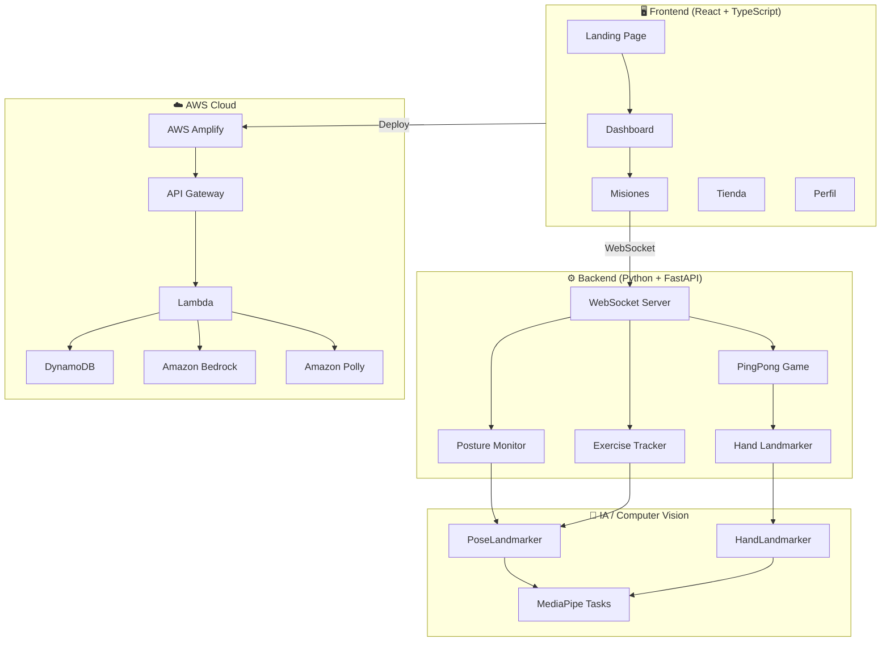
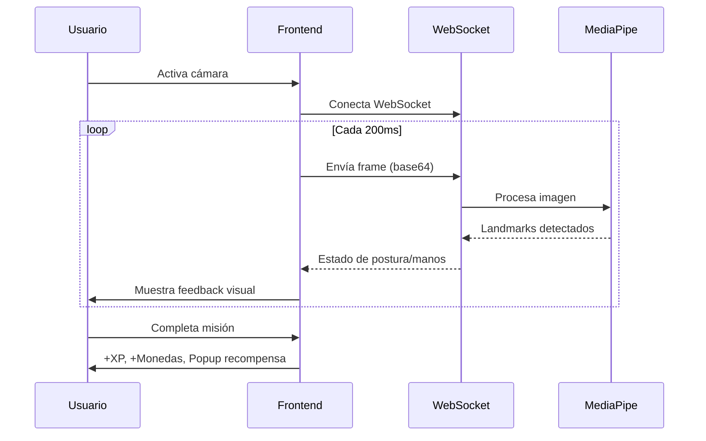
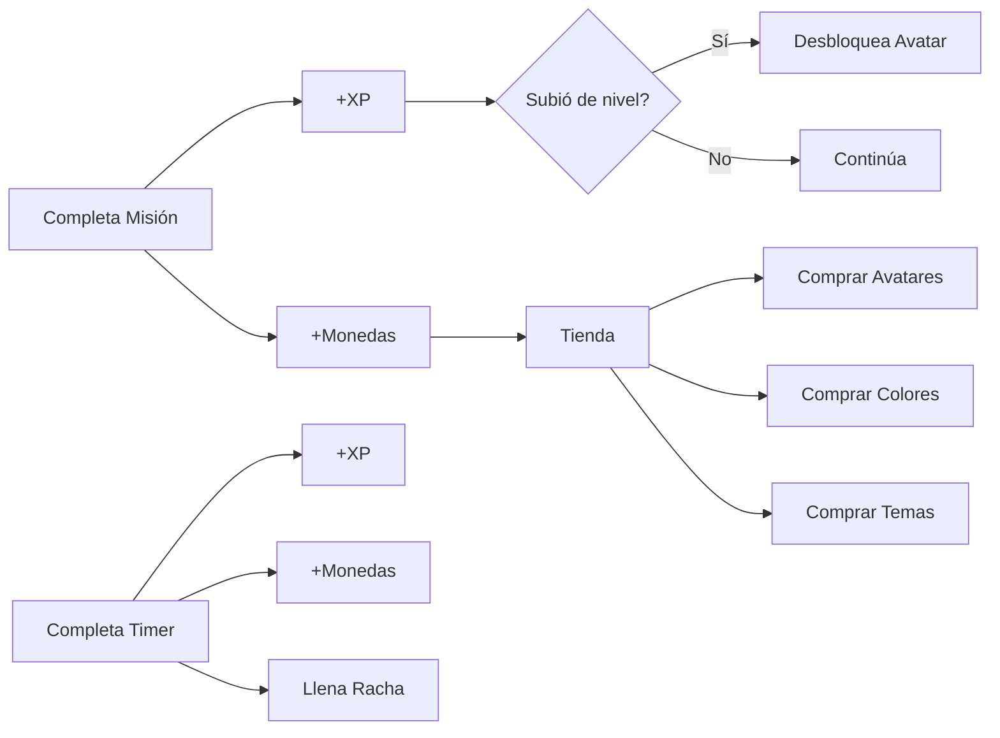

# 🐱 Ctrl + Rest

### Programa con enfoque. Descansa con propósito.

<p align="center">
  
</p>

<p align="center">
  <strong>Plataforma web gamificada que convierte tus pausas activas en misiones interactivas para cuidar tu bienestar físico y mental, mientras ganas BreakPoints.</strong>
</p>

<p align="center">
  
  
  
  
  
  
  
</p>

---

## 📋 Tabla de Contenidos

- [¿Qué es Ctrl + Rest?](#-qué-es-ctrl--rest)
- [Funcionalidades](#-funcionalidades)
- [Arquitectura](#-arquitectura)
- [Tech Stack](#-tech-stack)
- [Instalación](#-instalación)
- [Uso](#-uso)
- [Estructura del Proyecto](#-estructura-del-proyecto)
- [Equipo](#-equipo)

---

## 🎯 ¿Qué es Ctrl + Rest?

Ctrl + Rest es una plataforma web diseñada para desarrolladores que pasan largas horas frente al computador. Utilizando **visión por computadora** y **gamificación**, la plataforma:

- 🧘 Detecta mala postura en tiempo real
- ⏱️ Gestiona sesiones de enfoque con timer Pomodoro
- 🎮 Ofrece misiones interactivas como pausas activas
- 🏆 Recompensa con XP y monedas por cada actividad completada
- 🛍️ Incluye tienda de personalización con avatares y temas
- 🐱 Cuenta con Blizzy, un gato mascota que te motiva

---

## ✨ Funcionalidades

| Misión | Descripción | Tecnología |
|--------|-------------|------------|
| 🦴 Monitor de Postura | Detecta mala postura en tiempo real | MediaPipe PoseLandmarker |
| 🧘 Pausa Activa | Ejercicio guiado de giro de cuello | MediaPipe PoseLandmarker |
| 🏓 AR Ping Pong | Juego de ping pong con detección de manos | MediaPipe HandLandmarker |
| 🎨 AR Paint | Dibuja en el aire con tus manos | MediaPipe HandLandmarker |
| 😺 Memes de Blizzy | Generador de memes con poses del gato | Canvas API |

### Características adicionales:
- ⏱️ **Timer Pomodoro** con opciones de 5, 10, 15, 25, 30, 45 minutos
- 🔥 **Racha diaria** que se llena al completar sesiones
- 💰 **Sistema de monedas** para comprar en la tienda
- 🛍️ **Tienda** con avatares, colores de perfil y temas de página
- 👤 **Perfil editable** con nickname y avatar personalizable
- 🎁 **Sección de regalos** con QR y perfiles sociales
- 💬 **Comunidad** para dejar opiniones
- 📈 **Sistema de niveles** que desbloquea recompensas

---

## 🏗️ Arquitectura



### Flujo de datos en tiempo real:



### Sistema de gamificación:



---

## 🛠️ Tech Stack

### Frontend
| Tecnología | Uso |
|-----------|-----|
| React 18 | UI Components |
| TypeScript | Type Safety |
| Vite 5 | Build Tool |
| CSS3 | Estilos (BEM) |
| Google Material Symbols | Iconografía |
| WebSocket API | Comunicación en tiempo real |
| Canvas API | Dibujo AR y Memes |

### Backend
| Tecnología | Uso |
|-----------|-----|
| Python 3.11 | Runtime |
| FastAPI | Framework Web |
| Uvicorn | ASGI Server |
| MediaPipe Tasks | Visión por Computadora |
| OpenCV | Procesamiento de imágenes |
| NumPy | Cálculos numéricos |

### Cloud (AWS)
| Servicio | Uso |
|---------|-----|
| AWS Amplify | Hosting Frontend |
| API Gateway | REST API |
| Lambda | Funciones serverless |
| DynamoDB | Base de datos |
| Amazon Bedrock | IA Generativa |
| Amazon Polly | Text-to-Speech |

---

## 🚀 Instalación

### Prerrequisitos
- Node.js 18+
- Python 3.11+
- pip

### Backend

```bash
cd backend
pip install -r requirements.txt
python -m uvicorn app.main:app --host 0.0.0.0 --port 8000
```

### Frontend

```bash
cd frontend
npm install
npm run dev
```

La app estará disponible en `http://localhost:3000`

---

## 📖 Uso

1. **Landing Page** → Haz clic en "Iniciar sesión"
2. **Dashboard** → Ve a la sección de Misiones
3. **Activa la cámara** → Permite acceso a la webcam
4. **Selecciona una misión** → Monitor de Postura, Pausa Activa, AR Ping Pong, AR Paint o Memes
5. **Gana recompensas** → XP, monedas, sube de nivel
6. **Personaliza** → Compra avatares, colores y temas en la tienda

---

## 📁 Estructura del Proyecto

```
ctrl-rest/
├── backend/
│   ├── app/
│   │   ├── main.py          # FastAPI + WebSocket server
│   │   ├── posture.py       # Algoritmo de detección de postura
│   │   ├── exercise.py      # Tracker de ejercicios
│   │   └── pingpong.py      # Lógica del juego AR
│   ├── models/
│   │   ├── pose_landmarker_lite.task
│   │   └── hand_landmarker.task
│   └── requirements.txt
├── frontend/
│   ├── public/              # Assets (imágenes de Blizzy)
│   ├── src/
│   │   ├── components/
│   │   │   ├── LandingPage.tsx    # Página de presentación
│   │   │   ├── Dashboard.tsx      # Panel principal
│   │   │   ├── PausaScreen.tsx    # Ejercicio de cuello
│   │   │   ├── PingPongGame.tsx   # Juego AR
│   │   │   ├── ARPaintGame.tsx    # Dibujo AR
│   │   │   └── MemeGenerator.tsx  # Generador de memes
│   │   ├── hooks/
│   │   │   └── usePostureSensor.ts  # Hook WebSocket + cámara
│   │   ├── types/
│   │   │   └── posture.ts
│   │   ├── App.tsx
│   │   └── App.css
│   ├── package.json
│   ├── tsconfig.json
│   └── vite.config.ts
├── .gitignore
└── README.md
```

---

## 👩‍💻 Equipo

| Nombre | Rol | Descripción |
|--------|-----|-------------|
| **Valentina G.** | UI/UX Designer | Diseñadora apasionada por crear experiencias intuitivas y visuales que conecten |
| **María P.** | Frontend Developer | Desarrolladora frontend con amor por los detalles y las interfaces accesibles |
| **Laura M.** | Backend Developer | Apasionada por la lógica, las API y construir soluciones escalables en la nube |
| **Sofía R.** | DevOps Engineer | Encargada de la infraestructura y la integración de servicios en AWS |

---

## 🏆 Hackathon Código Facilito 2026

Este proyecto fue desarrollado para el **Hackathon de Código Facilito** con el objetivo de mejorar el bienestar de los desarrolladores a través de la tecnología y la gamificación.

### Herramientas utilizadas en el desarrollo:
- **Kiro** — IDE con IA para desarrollo asistido
- **AWS** — Infraestructura cloud

---

<p align="center">
  
  <br>
  <em>Hecho con 💜 por el equipo Ctrl + Rest</em>
</p>
